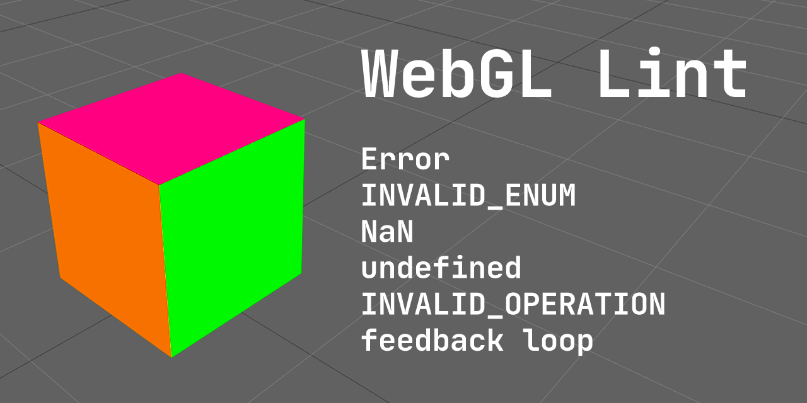

# WebGL Lint



WebGL lint is a script you can throw into your WebGL project
to check for common WebGL errors.

* Calls `getError` after every function and throws if there was an error.

* Checks that no arguments to any functions are `undefined`. 

  Pass `0` or `false` or `null` where you mean `0` or `false` or `null`.

* Checks that no numbers or values in arrays of numbers are `NaN`. 

* Checks that all non-sampler uniforms are set. (see configuration below)

* Checks that uniform matrices are not all zero.

* Warns if you try to access an undefined uniform.

* Checks for out of range access issues and will tell you which attribute/s are out of range

* Checks that shaders compile. On failure prints the shader and tries to highlight errors.

* Checks that programs link. On failure prints the attached shaders.

* If there is a WebGL error it tries to provide more info about why

  * for framebuffer feedback it will tell you which textures assigned to which uniforms and which attachments
  
  * for other errors it will try print extra info where possible.

  * it lets you name webgl objects so those names can be shown in the error messages.

## Example

**Open the JavaScript console**. You'll see the first example prints fewer
errors and less info where as the second prints much more info.

* [without script](https://greggman.github.io/webgl-lint/test/?lint=false)
* [with script](https://greggman.github.io/webgl-lint/test/)

# Usage

```
<script src="https://greggman.github.io/webgl-lint/webgl-lint.js" crossorigin></script>
```

or 

```
import 'https://greggman.github.io/webgl-lint/webgl-lint.js';
```

WebGL Lint `throw`s a JavaScript exception when there is an issue so if you are
using `try`/`catch` to catch errors you might need to print the exceptions
inside your catch block. You can also turn on "pause on exception" on your
JavaScript debugger.

Throwing seemed more a appropriate than just printing an error because if you
get an error you should fix it! I tried the script out with all the
[three.js examples](https://threejs.org/examples). It found 1 real bug and several half bugs.
By half bugs I mean there were several examples that functioned but were actually
passing `NaN` or `null` in the wrong places for a few frames or they were not setting
uniforms that probably should have been set. Arguably it's
better to fix those so that you can continue to use the helper to find real
errors. In any case most of examples ran without error so you can do it
too! 😉

### `GMAN_debug_helper` extension

WebGL Lint adds a special extension `GMAN_debug_helper` with these functions

* `tagObject(obj: WebGLObject, name: string): void` - see naming below
* `untagObject(obj: WebGLObject): void` - see naming below
* `getTagForObject(obj: WebGLObject): string` - see naming below
* `setConfiguration(settings): void` - see configuration below
* `disable(): void` - turns off the checking
* `getAndResetRedundantCallInfo(): RedundantCallInfo` - see below

### Configuration

You don't need to configure anything to use in general but there are some settings
for special needs.

* `maxDrawCalls` (default: 1000)

  Turns off the checking after this many draw calls. Set to 0 to check forever.

* `failUnsetUniforms`: (default: true)

  Checks that you set uniforms except for samplers and fails if you didn't.
  It's a common error to forget to set a uniform or to mis-spell the name of
  a uniform and therefore not set the real one. The common exception is
  samplers because uniforms default to 0 so not setting a sampler means use
  texture unit 0 so samplers are not checked.
  
  Of course maybe you're not initializing some uniforms on purpose
  so you can turn off this check. I'd recommend setting them so you get the
  benefit of this check finding errors.

  Note: uniform blocks are not checked directly. They are checked by WebGL itself
  in the sense that if you fail to provide uniform buffers for your uniform blocks
  you'll get an error but there is no easy way to check that you set them.

* `failUnsetSamplerUniforms`: (default: false)

  See above why sampler uniforms are not checked by default. You can force them
  to be checked by this setting.

* `failZeroMatrixUniforms`: (default: true)

  Checks that a uniform matrix is not all zeros. It's a common source of errors to
  forget to set a matrix to the identity and it seems uncommon to have an all
  zero matrix. If you have a reason a matrix needs to be all zeros you may want
  to turn this off. 

* `failUnrenderableTextures`: (default: true)

  Unrenderable textures are not an error in WebGL, they just don't render.
  WebGL itself usually print's a warning but it's usually fairly cryptic
  just telling you an unrenderable texture exists but not much else.

  Examples of unrenderable textures are non-power of 2 textures in WebGL1
  with filtering set to need mips and wrap not set to `CLAMP_TO_EDGE` or
  in both WebGL and WebGL2 would be mips of different internal formats
  or the wrong size.

* `failUndefinedUniforms`: (default: false)

  WebGL by default returns `null` when you call `gl.getUniformLocation` for
  a uniform that does not exist. It then silently ignores calling `gl.uniformXXX`
  if the location is `null`. This is great when you're editing a shader in that
  if you remove a uniform from the shader your code that is still setting
  the old uniform will keep working.
  
  For example if you are debugging and you go to the bottom of your fragment
  shader and add `gl_FragColor = vec4(1, 0, 0, 1);` all the uniforms in your
  fragment shader will be optimized out. If WebGL suddenly issues errors trying
  to set those it would be much more frustrating to debug. Conversely though, if
  you have a typo, for example you want to look up the location of `'u_color'` and
  you type `gl.getUniformLocation(prg, 'uColor')` you'll get no error and it
  will likely take you a while to find your typo.

  So, by default webgl-lint only prints a warning for undefined uniforms.
  You can make throw by setting `failUndefinedUniforms` to `true`.

* `failBadShadersAndPrograms`: (default: true)

  Most WebGL programs expect all shaders to compile and all programs
  to link but often programmers don't check for errors. While it's likely
  they'd get an error about a bad program further in their code, at that point
  it's likely too late to tell them it's because the program didn't compile or
  link. Instead the message will just be something like "no valid program in use".

  If you're working on a project that expects shaders to fail to compile
  and/or programs to link you can set this to `false`.

* `warnUndefinedUniforms`: (default: true)

  See `failUndefinedUniforms`. Setting this to false turns off warnings
  about undefined uniforms.

* `ignoreUniforms`: (default: [])

  Lets you configure certain uniforms not to be checked. This way you can turn
  off checking for certain uniforms if they don't obey the rules above and still
  keep the rules on for other uniforms. This configuration is additive. In other words

  ```js
  ext.setConfiguration({ignoreUniforms: ['foo', 'bar']});
  ext.setConfiguration({ignoreUniforms: ['baz']});
  ```

  Ignores uniforms called 'foo', 'bar', and 'baz'.

* `throwOnError`: (default: true)

  The default is to throw an exception on error. This has several benefits.

  1. It encourages you to fix the bug.

  2. You'll get a stack trace which you can drill down to find the bug.

  3. If you use "pause on exception" in your browser's dev tools you'll
     get a live stack trace where you can explore all the local variables
     and state of your program.

  But, there might be times when you can't avoid the error, say you're
  running a 3rd party library that gets errors. You should go politely
  ask them to fix the bug or better, fix it yourself and send them a pull request.
  In any case, if you just want it to print an error instead of throw then
  you can set `throwOnError` to false.

* `makeDefaultTags`: (default: true)

  If true, all objects get a default tag, Example `*UNTAGGED:Buffer1`,
  `*UNTAGGED:Buffer2` etc. This is a minor convenience to have something
  to distinguish one object from another though it's highly recommended
  you tag your objects. (See naming).

  The only reason to turn this off is if you're creating and deleting
  lots of objects and you want to make sure tags are not leaking memory
  since tags are never deleted automatically. (See "naming).

There 2 ways to configure

1.  Via the extension and JavaScript.

    Example:

    ```js
    const gl = someCanvas.getContext('webgl');
    const ext = gl.getExtension('GMAN_debug_helper');
    if (ext) {
      ext.setConfiguration({
        maxDrawCalls: 2000,
        failUnsetSamplerUniforms: true,
      });
    }
    ```

2. Via an HTML dataset attribute

   Example:

   ```html
   <script
     src="https://greggman.github.io/webgl-lint/webgl-lint.js"
     data-gman-debug-helper='
       {
         "maxDrawCalls": 2000, 
         "failUnsetSamplerUniforms": true
       }
     '>
   </script>
   ```

   Note: (1) the setting string must be valid JSON. (2) any tag will do, `<div>`, `<span>`, etc. as the
   script just applies all tags it finds with `querySelectorAll('[data-gman-debug-helper]')` and applies
   the options in the order found.

### Naming your WebGL objects (buffers, textures, programs, etc..)

Using the extension you can name your objects. This way when an error is printed
the names will be inserted where appropriate.

```js
const ext = gl.getExtension('GMAN_debug_helper');
const tex = gl.createTexture();
ext.tagObject(tex, 'background-tex');
```

Now if you get an error related to `tex` you might get an told it's related to 'background-tex'
instead of just that you got an error.

4 suggestions for using naming

1.  make some helpers

    ```js
    const ext = gl.getExtension('GMAN_debug_helper');
    const tagObject = ext ? ext.tagObject.bind(ext) : () => ();
    ```

    now you can just unconditionally tag things and if the extension does
    not exist it will just be a no-op.

    ```js
    const tex = gl.createTexture();
    tagObject(tex, 'checkerboard');
    ```
  
2.  wrap the creations functions

    ```js
    const ext = gl.getExtension('GMAN_debug_helper');
    if (ext) {
      Object.keys(gl.__proto__)
        .filter(name => name.startsWith('create'))
        .forEach(name => {
          const origFn = gl[name];
          if (origFn) {
            gl[name] = function(...args) {
              const obj = origFn.call(this, ...args);
              if (obj) {
                ext.tagObject(obj, args[args.length - 1] || '*unknown*');
              }
              return obj;
            }
          }
        });
    }
    ```

    Which you use like this

    ```js
    const shader = gl.createShader(gl.VERTEX_SHADER, 'phongVertexShader');
    const tex = gl.createTexture('tree-texture');
    ```

    and they'll still work in normal WebGL as it will ignore
    the extra parameter.

3. Same as above but not wrapped

    ```js
    const ext = gl.getExtension('GMAN_debug_helper');
    const api = Object.fromEntries(
        Object.keys(gl.__proto__)
          .filter(name => name.startsWith('create'))
          .map(name => {
            const func = (ext && gl[name])
              ? function(...args) {
                  const obj = gl[name](...args);
                  if (obj) {
                    ext.tagObject(obj, args[args.length - 1] || '*unknown*');
                  }
                  return obj;
                }
              : function(...args) {
                  return gl[name](...args);
                };
            return [name, func];
          }));
    ```

    Which you use like this

    ```js
    const shader = api.createShader(gl.VERTEX_SHADER, 'phongVertexShader');
    const tex = api.createTexture('tree-texture');
    ```

    If you're allergic to hacking native APIs this is better but you have to
    remember to use `api.createXXX` instead of `gl.createXXX`

4.  Use your own API.

    Lots of people have wrapped WebGL themselves with things like `class Texture` and
    `class Framebuffer` or other functions. Those would be a good place to integrate
    tagging.

As a simple example, naming buffers after the attributes they'll
be used with (eg. 'position', 'normal'), naming textures by the URL of the img where they
get their data. Naming vertex array objects by the model ('tree', 'car', 'house'), naming
framebuffers by their usage ('shadow-depth', 'post-processing'), naming programs by what they do ('phong-shading', 'sky-box')...

You can also untag an object with

```js
ext.untagObject(someObj);
```

Arguably for debugging you probably don't want to untag. The problem with
untagging is if you untag and then have a bug where you reuse an untagged
object, for example using an object you deleted, there will be no tag for the
object, so your error will just say something like "error: tried to use
Texture(unknown)" instead of "error: tried to use Texture(yourTag)". At the same
time, if you're running WebGL-lint indefinitely (see `maxDrawCalls`) and
creating and deleting lots of objects, for example sync objects, there is a tiny
bit of memory involved keeping the label of each one so manually untagging
should mean you are not leaking memory. Honestly I wouldn't worry about
untagging but it's here just in case you've got special needs. Also see
`makeDefaultTags` above.

The extension also includes `getTagForObject` if you want to look up
what string you tagged an object with

```js
const buf = gl.createBuffer();
ext.tagObject(buf, 'normals');
console.log(ext.getTagForObject(buf));  // prints 'normals'
```

## Checking for redundant calls

An example of a redundant call is calling `gl.useProgram` with the same program
or calling `gl.vertexAttribPointer` with the same parameters and the same buffer.
You can get a count to date of the redundant state setting WebGL-Lint has detected
by calling `ext.getAndResetRedundantCallInfo()`

Example:

```js
function render() {
  // .. do stuff with webgl ..

  const info = ext.getAndResetRedundantCallInfo();
  console.log(JSON.stringify(info));
  requestAnimationFrame(render);
}
```

Alternatively you can try adding this script to your page (**instead of `webgl-lint.js`**) and it will
attempt to print redundant call info for you.

```html
<script type="module" src="https://greggman.github.io/webgl-lint/webgl-lint-check-redundant-state-setting.js"></script>
```

or

```js
import 'https://greggman.github.io/webgl-lint/webgl-lint-check-redundant-state-setting.js';
```

Note: WebGL-Lint does not check every possible redundant set setting. At the moment it checks

* `bindBuffer`
* `bindFramebuffer`
* `bindRenderbuffer`
* `bindSampler`
* `bindTexture`
* `bindVertexArray`
* `enable`
* `disable`
* `vertexAttribPointer`
* `vertexAttribIPointer`

It's not important to avoid 100% of redundant state setting. Rather, you can use
this feature to see if you have too much redundant state setting. For example if
you're making 2000 draw calls and you see 500-5000 redundant state setting
counts then you should probably look into adding some state tracking in your own
code or organizing the way calls happen so state is not set. It's not so much
that setting state more than once is bad, it's rather than it's just proof your
code is doing extra work. If it's a lot of extra work then you probably want to
look into it. If it's only a small amount of extra work then don't worry about
it.

# Suggestions?

[https://github.com/greggman/webgl-lint/issues](https://github.com/greggman/webgl-lint/issues)

# Development

You can run the tests with the un-merged code with `http://localhost:8080/test/?src=true`. You can also filter the tests with `grep=` as in
`http://localhost:8080/test/?grep=shader` or both 
`http://localhost:8080/test/?src=true&grep=shader`.

# Repo

[https://github.com/greggman/webgl-lint/](https://github.com/greggman/webgl-lint/)

# License

[MIT](LICENSE.md)
